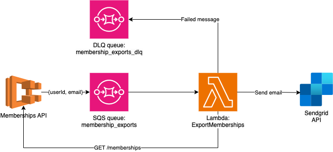

# Memberships Export Service Architecture

## Overview
This document describes the architecture of a microservice running on AWS to handle memberships data export. The system leverages Amazon ECS, SQS, Lambda, and a Dead Letter Queue (DLQ) for request processing and failure management.

## Architecture Diagram

## Architecture Description

1. **ECS Service (memberships-api)**:  
   The entry point of the system is existing **memberships-api**. Assumtion here is that API service already exists and being extended with export functionality. It could be served as ECS service. It handles incoming requests for exporting memberships.

2. **Export Request (`GET /memberships/export`)**:  
   When the `GET /memberships/export` endpoint is called, the `memberships-api` service sends a message to the **SQS queue (membership_exports)**. The message contains attributes such as `userId` and `email` so we don't need to refetch customer info for export.

3. **SQS Queue (membership_exports)**:  
   The **membership_exports** queue receives the message from the ECS service. The queue then triggers the **ExportMemberships Lambda function** to process the request asynchronously.

4. **Lambda Function (ExportMemberships)**:  
   The **ExportMemberships** Lambda function is invoked by the SQS queue. It performs the following tasks:
   - Makes an API call to the **memberships-api** service (`GET /memberships`) to fetch the membership data.
   - Generates a CSV file with the membership data.
   - Sends the CSV file via email to the customer using the **Sendgrid API**.

5. **Failure Handling and Dead Letter Queue (DLQ)**:  
   If the Lambda function fails for any reason, the message is sent to a **Dead Letter Queue (membership_exports_dlq)**. This ensures that failed messages can be inspected and reprocessed at a later time.

## Benefits
- **Asynchronous Processing**: The use of SQS and Lambda allows for asynchronous processing of export requests, improving the scalability of the system.
- **Scalability**: The architecture can easily scale to handle a large number of export requests as Lambda functions can be scaled automatically based on the number of messages in the queue. We could also limit the number of concurrent executions of the Lambda function to avoid overloading of "Memberships API".
- **Resilient Failure Handling**: The Dead Letter Queue (DLQ) ensures that failed tasks can be reprocessed, adding fault tolerance to the architecture.
- **Cost-Effective**: The serverless nature of Lambda functions means that costs are incurred only when the function is executed, making it cost-effective for sporadic export requests.

## Considerations
- To further improve resilience, we could consider splitting lambda function into multiple smaller functions, each responsible for a specific part of the export process (e.g., fetching data, generating CSV, sending email). This would allow for better error handling and allow avoiding reprocessing the whole export in case of a failure.
- We could implement a mechanism to track the status of the export request and provide feedback to the user on the progress of the export (e.g., "Export in progress", "Export completed", "Export failed").